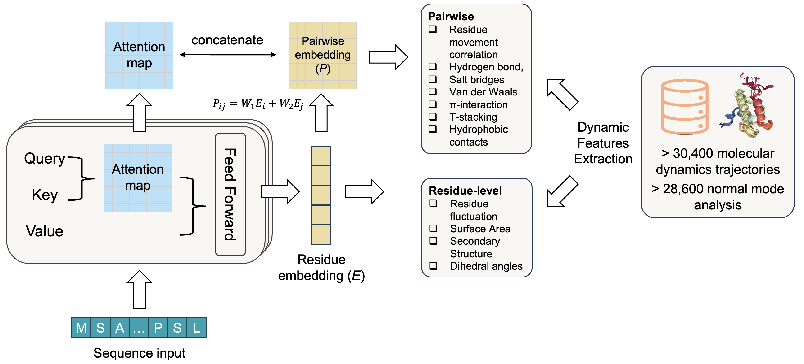

# SeqDance and ESMDance: Protein Language Models Trained on Protein Dynamic Properties


## Abstract
Proteins function by folding amino acid sequences into dynamic structural ensembles. Despite the important role of protein dynamics, their inherent complexity and the absence of efficient integration methods have limited their incorporation into deep learning models for studying protein behaviors and mutation effects. To address this, we developed SeqDance and ESMDance, protein language models pre-trained on dynamic biophysical properties derived from molecular dynamics trajectories of over 35,800 proteins and normal mode analyses of over 28,500 proteins. SeqDance, which operates solely on sequence input, captures local dynamic interactions and global conformation properties for both ordered and disordered proteins, even for proteins without homologs in the pre-training dataset. SeqDance predicted dynamic property changes are predictive of mutation effects on protein folding stability. ESMDance, which utilizes ESM2 outputs, significantly outperforms ESM2 in zero-shot prediction of mutation effects for designed and viral proteins. SeqDance and ESMDance offer novel insights into protein behaviors and mutation effects through the perspective of protein dynamics.





## SeqDance/ESMDance Pre-training and Usage
### Pre-training
SeqDance/ESMDance were trained using Python, PyTorch, and the Transformers library. For detailed environment setup, please refer to [SeqDance_env.yml](SeqDance_env.yml). For details on the model architecture and pre-training process, please refer to codes in the [model](./model/) directory.
```
conda env create -f SeqDance_env.yml
conda activate seqdance
python -m torch.distributed.run --nnodes=1 --nproc_per_node=4 model/train_ddp.py
```
If you don't want to use SeqDance_env.yml, a new environment with pytorch=2.5.1, transformers=4.48.2, and h5py (install three packages with conda) should work for the pre-training. We provide the training sequences and extracted features in [Hugging face](https://huggingface.co/datasets/ChaoHou/protein_dynamic_properties), please process the data as described in Hugging face before pre-training the model.

SeqDance/ESMDance were trained via [distributed data parallel](https://pytorch.org/tutorials/intermediate/ddp_tutorial.html). The detailed hyperparameters are listed in [config](./model/config.py). The pre-training took ten days on a server with four L40s GPUs. 


### Pre-trained weight
You can download the pre-trained SeqDance weights here: [](https://doi.org/10.5281/zenodo.13909695). 


## Protein Dynamic Dataset
All pre-training datasets used in SeqDance are publicly available. 


| Source         | Description                                      | Number  | Method                            |
|----------------|--------------------------------------------------|---------|------------------------------------|
| [ATLAS](https://www.dsimb.inserm.fr/ATLAS/index.html)  | Ordered structures in PDB (no membrane proteins) | 1,516   | All-atom MD, 3x100 n              |
| [ATLAS](https://www.dsimb.inserm.fr/ATLAS/index.html)  | Ordered structures in PDB (no membrane proteins) | 1,516   | All-atom MD, 3x100 ns              |
| [PED](https://proteinensemble.org/)              | Disordered regions                             | 382     | Experimental and other methods     |
| [GPCRmd](https://www.gpcrmd.org/)               | Membrane proteins                              | 509     | All-atom MD, 3x500 ns              |
| [IDRome](https://github.com/KULL-Centre/_2023_Tesei_IDRome)       | Disordered regions                             | 28,058  | Coarse-grained MD, converted to all-atom |
| [ProteinFlow](https://github.com/adaptyvbio/ProteinFlow)          | Ordered structures in PDB                      | 28,631  | Normal mode analysis               |


### Coarse-grained MD Conversion
IDRome trajectories were converted to all-atom trajectories using [cg2all](https://github.com/huhlim/cg2all), with the following command:  
```
convert_cg2all -p top_ca.pdb -d traj.xtc -o traj_all.dcd -opdb top_all.pdb --cg CalphaBasedModel
```

## Feature Extraction
### MD Trajectory Feature Extraction
We extracted residue-level and pairwise dynamic features from MD trajectories:

- **Residue-level features**: Root mean square fluctuation (RMSF), surface area, secondary structure (eight classes), and dihedral angles (phi, psi, chi1).
- **Pairwise features**: Correlation of Cα movements, and frequencies of hydrogen bonds, salt bridges, Pi-cation, Pi-stacking, T-stacking, hydrophobic, and van der Waals interactions.

[GetContacts](https://getcontacts.github.io/) was used to extract nine types of interactions from MD trajectories:

```
cd data_prepare/molecular_dynamics
get_dynamic_contacts.py --itypes hb sb pc ps ts hp vdw --cores 2 --topology 3tvj_I.pdb --trajectory 3tvj_I_10frames.dcd --output 3tvj_I_10frames_contact.tsv
```


After extract interactions, you can use [MDTraj v1.9.9](https://www.mdtraj.org/) to generate the residue-level and pairwise features with:
```
cd data_prepare/molecular_dynamics
python MD_features.py -p 3tvj_I.pdb -t 3tvj_I_10frames.dcd -i 3tvj_I_10frames_contact.tsv -o 3tvj_I
```
`-p`: PDB structure file; `-t`: MD trajectory file (.dcd format here); `-i`: interaction tsv file from GetContacts; `-o`: file name for residue features and pairwise features.


### Normal Mode Analysis Feature Extraction
For NMA data, we used [ProDy v2.4.0](http://www.bahargroup.org/prody/index.html) to conduct the analysis. Normal modes were categorized into three frequency-based clusters. For each cluster, residue fluctuation and pairwise correlation maps were computed.  
```
cd data_prepare/normal_mode_analysis
python NMA_features.py -i 2g3r.pdb -o nma_residue_pair_features_2g3r
```
`-i`: PDB structure file; `-o`: file name for NMA features.

We recommend installing [GetContacts](https://getcontacts.github.io/), [MDTraj](https://www.mdtraj.org/), and [ProDy](http://www.bahargroup.org/prody/index.html) in different conda environments from the [SeqDance pre-training environment](SeqDance_env.yml). Installing all required packages took about a hour in our server.  
The feature extraction process is the most complicated step in our work, it took us over a month.